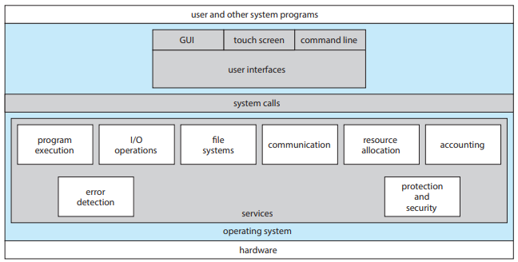
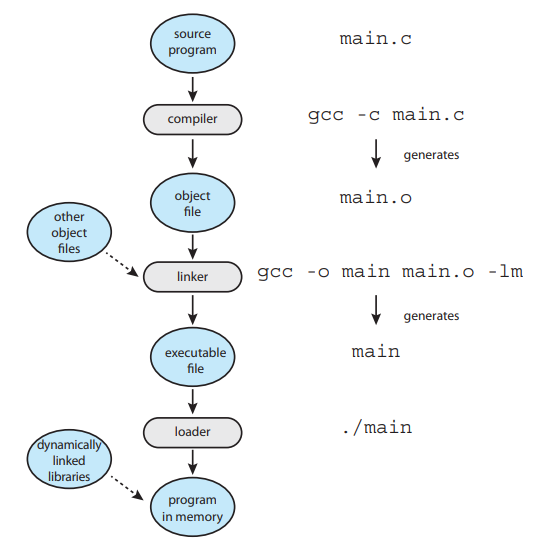
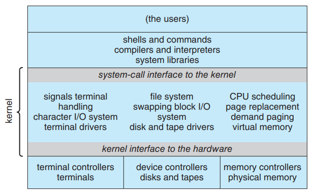
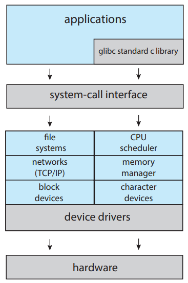
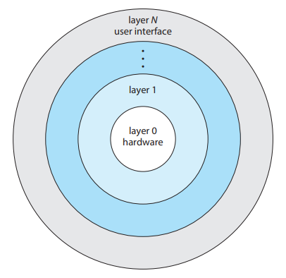
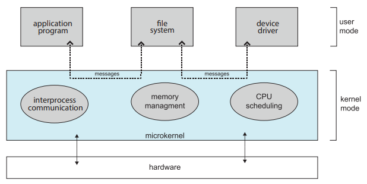
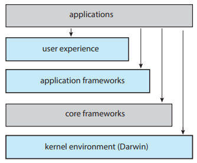
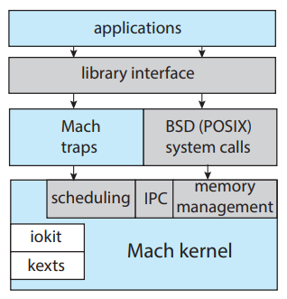
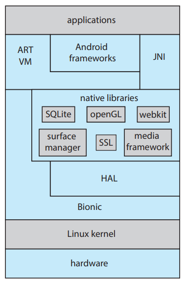

# Chapter 02 -- 作業系統結構 (Operating-System Structures) #

## Chapter Objectives ##

* Identify services provided by an operating system.
  * 認識作業系統提供的服務
* Illustrate how system calls are used to provide operating system services.
  * 說明系統呼叫如何提供作業系統服務
* Compare and contrast monolithic, layered, microkernel, modular, and
hybrid strategies for designing operating systems.
  * 比較和對比用於設計作業系統的單片、分層、微核心、模組和混合策略
* Illustrate the process for booting an operating system.
  * 說明啟動作業系統的過程
* Apply tools for monitoring operating system performance.
  * 應用工具來監視作業系統性能
* Design and implement kernel modules for interacting with a Linux kernel.
  * 設計和實現用於與 Linux 核心交互的核心模組

## Section ##

* [2.1 作業系統服務 (Operating-System Services)](#21-作業系統服務-operating-system-services)
* [2.2 使用者與作業系統介面 (User and Operating-System Interface)](#22-使用者與作業系統介面-user-and-operating-system-interface)
* [2.3 系統呼叫 (System Calls)](#23-系統呼叫-system-calls)
* [2.4 系統服務 (System Services)](#24-系統服務-system-services)
* [2.5 鏈結器與載入器 (Linkers and Loaders)](#25-鏈結器與載入器-linkers-and-loaders)
* [2.6 為什麼應用程式是特定作業系統 (Why Applications Are Operating-System Specific)](#26-為什麼應用程式是特定作業系統-why-applications-are-operating-system-specific)
* [2.7 作業系統的設計和製作 (Operating-System Design and Implementation)](#27-作業系統的設計和製作-operating-system-design-and-implementation)
* [2.8 作業系統結構 (Operating-System Structure)](#28-作業系統結構-operating-system-structure)
* [2.9 構建和啟動作業系統 (Building and Booting an Operating System)](#29-構建和啟動作業系統-building-and-booting-an-operating-system)
* [2.10 作業系統除錯 (Operating-System Debugging)](#210-作業系統除錯-operating-system-debugging)
* [2.11 摘要 (Summary)](#211-摘要-summary)

## 2.1 作業系統服務 (Operating-System Services) ##

    

* 使用者介面 (User Interface, UI)
  * 圖形使用者介面 (Graphical User Interface, GUI)
  * 觸控螢幕介面 (Touch-Screes Interface)
  * 命令行介面 (Command-Line Interface, CLI)

* 系統呼叫 (System Calls)

* 作業系統服務 (Operating-System Services)
  * 對使用者有幫助的功能
    * 程式執行 (Program execution)
    * I/O 作業 (I/O operations)
    * 檔案系統的使用 (File-system manipulation)
    * 通信 (Communications)
      1. 共用記憶體 (Shared Memory)
      2. 訊息傳遞 (Message Passing)
    * 錯誤偵測 (Error detection)
  * 為了確保系統能有效運作
    * 資源分配 (Resource allocation)
    * 紀錄檔記錄 (Logging)
    * 保護和安全 (Protection and security)

## 2.2 使用者與作業系統介面 (User and Operating-System Interface) ##

* 命令行列介面 (CLI), 命令解譯器 (Command Interpreter)
  * 又可稱為外殼 (Shell)
    1. C shell
    2. Bourne-Again (或 bash) shell
    3. Korn shell
  * 在 UNIX 中，命令解譯器並不了解命令的涵義，它是使用命令來指定一個要載入記憶體及執行的檔案。
    * rm file.txt => 尋找叫作 rm 的檔案，將它載入記憶體，並將參數 file.txt 傳給他。
* 圖形使用者介面 (Graphical User Interface, GUI)
  * 使用圖像 (Icon) 代表程式、檔案、目錄和系統功能。
  * 第一個 GUI 是 1973 年出現在 Xerox Alto 電腦上。
  * 在 UNIX 或 Linux 系統上執行的 K Desktop Environment (KDE) 或 GNOME 桌面。
* 觸控螢幕介面 (Touch-Screes Interface)
  * 利用手勢 (Gesture) 來進行互動。
* 選擇介面
  * 管理電腦的系統管理員 (System Administrator) 和對系統比較了解的超級使用者 (Power User) 通常會使用 CLI 。
  * 外殼劇本 (Shell Scripts)
    * 一組命令步驟，記錄在檔案中，不會被編譯成執行碼，而是由 CLI 直接解譯。

## 2.3 系統呼叫 (System Calls) ##

* 提供一個由 Operating-System Services 的介面。
* 一般以 C 或 C++ 寫成的函數。如果系統呼叫是比較低階的工作 (ex.硬體須直接存取) 將可能要以組合語言指令來寫。
* 應用程式設計界面
  * 應用程式開發人員依照應用程式介面 (Application Programming Interface, API) 設計程式。
  * 應用程式設計者三個最常用的 API
    1. Windows API
    2. 以 POSIX 系統為基礎的 POSIX API (包括所有的 UNIX, Linux, macOS 的版本)
    3. Java 虛擬機上執行 Java 程式的 Java API
  * 在 UNIX 和 Linux 等程式是使用 C 語言寫的情況下，此函數庫稱為 libc 。
  * 執行時間環境 (Run-time environment, RTE)
  * 系統呼叫介面 (System-call Interface)
* 系統呼叫的類型可分為 6 大類
  1. 行程控制 (Process Control)
  2. 檔案管理 (File Management)
  3. 裝置管理 (Device Management)
  4. 資訊維護 (Information Maintenance)
  5. 通信 (Communication)
  6. 保護 (Protection)
  
## 2.4 系統服務 (System Services) ##

* 又稱為系統常式 (System Utilities)
* 提供程式開發與執行的便利環境
* 分類
  1. 檔案管理
  2. 狀態資訊
  3. 檔案修改
  4. 程式語言支援
  5. 程式的載入與執行
  6. 通信
  7. 背景服務
      * 一直執行的系統程式行程被稱為服務 (Services)、子系統 (Subsystems) 或守護程序。

## 2.5 鏈結器與載入器 (Linkers and Loaders) ##

    

* 可重定位物件檔案 (Relocatable Object File, .o file)
  * 來源檔案 (Source file, .c file) 被編譯器 (Compiler) 編譯成物件檔案，這些物件檔案被設計成可以載入到任何實體記憶體的位置，這種格式稱為可重定位物件檔案。
* 可執行的檔案 (Executable File, .exe file)
  * 鏈結器 (Linker) 將這些可重定位的物件檔案組合為單個二進制可執行的檔案。
* 載入器 (Loader)
  * 用於將二進制可執行檔案載入到記憶體中，該檔案可以在 CPU 核心上執行。
  * 要執行 Loader ，在命令列中輸入可執行檔案的名稱即可。
  * 與 Linker 和 Loader 相關的程序是重定位 (Relocation)。

## 2.6 為什麼應用程式是特定作業系統 (Why Applications Are Operating-System Specific) ##

* 基本上，在一個作業系統上編譯的應用程式並不能在其他作業系統上執行。
  * 舊時代，使選擇作業系統，因為在指定的作業系統上，才有需要的功能。
  * 現今，使執行選擇想使用的應用程式，因為現在的應用程式已實現跨平台的使用。
* 3 種方式，讓應用程式可以在多個作業系統上運行
  * 使用直譯語言 (ex. Python, Ruby)，該語言有可執行在多個作業系統的直譯器。
  * 使用包含正在運行應用程式的虛擬機 (Virtual Machine, VM) 的語言來撰寫應用程式。虛擬機是該語言完整運行環境 (Run-Time Env, RTE) 的一部分。
  * 應用程式開發人員可以使用標準語言或 API，在編譯器可以使用機器碼和作業系統中特定的語言生成二進制檔案。

## 2.7 作業系統的設計和製作 (Operating-System Design and Implementation) ##

* 設計目標
  * 使用者目的 (User Goal)
  * 系統目的 (System Goal)
* 機制與策略
  * 機制 (Mechanism) 和 策略 (Policy) 分離。
    * 策略決定做甚麼工作
    * 機制決定如何做某些工作
    * (p.s. 策略與機制 之於 架構與流程 的關係)
* 製作
  * 早期的作業系統是由組合語言寫成的。現在，大部分是用高階語言 (ex. C, C++) 寫成。
    * 最低層核心的程式:使用組合語言與 C 完成。
    * 高級別的常式:使用 C 和 C++ 撰寫。
    * 系統程式庫:用 C++ 甚至更高級別的語言編寫。
  * Android 系統
    * 核心 (Kernal or OS):使用 C 和某種組合語言編寫。
    * 系統程式庫:使用 C 或 C++ 編寫的。
    * 應用程式的框架, 系統提供開發人員介面:主要使用 Java 撰寫的。
  * 使用高階語言製作作業系統的唯一缺點，是降低速度和增加儲存需求。
  * 性能的改進，可以從較好的資料結構與演算法著手，並非只能單獨由優越的組合語言碼所達成。
  * 龐大的作業系統中，高性能關鍵的常式
    * 中斷處理程式
    * I/O 管理程式
    * 記憶體管理
    * CPU 排班
  * 系統在寫完及正確地工作之後，可以標出瓶頸的常式，並以等效地組合語言替換重構，以更有效地執行。

## 2.8 作業系統結構 (Operating-System Structure) ##

* 單一結構 (Monolithic Structure)
  * 為緊密耦合 (tightly coupled) 系統，因為對系統某一部分的更改，可能造成其它部份產生廣泛的影響。
  * 將核心的所有功能放到一個在單個位址空間中執行的靜態二進制檔案中。
  * 原始 UNIX 作業系統式這種有限架構的一個範例，分為核心與系統程式。
    * 核心
      1. 位於系統呼叫介面之下，於實體硬體之上層。
      2. 一系列界面和裝置驅動程式，包括檔案系統、CPU 排程、記憶體管理、和通過系統呼叫確定的其他作業系統功能。
  * Linux 作業系統是基於 UNIX 並且結構相類似。
    * 應用程式與核心的系統呼叫介面通信時，通常使用 glibc 的標準 C 程式庫。
    * Linux 核心在單個位址空間中，完全以核心模式進行，是單一結構。
  * 優勢
    * 系統呼叫介面的成本低
    * 核心內部的通信速度很快
  * 缺點
    * 難以實現與擴展

  
  
傳統的 UNIX 系統結構

  
  
Linux 系統結構

* 分層方法
  * 為鬆散耦合 (loosely coupled) 系統。
  * 系統模組化最常應用的是分層方式 (layered approach)。
  * 分層方式
    * 底部層 (第 0 層):硬體
    * 最高層 (第 N 層):使用者介面
    * 作業系統層 (第 M 層)
      1. 抽象物件的實現，負責資料和處理資料的操作。
      2. 包括資料結構和一組可讓較高層次呼叫的一組函數，也可以呼叫低層次的操作。
  * 層次選定後，每一層都只能使用較低層的功能與服務，方便作系統的除錯與驗證。

  
  
分層作業系統

* 微核心 (Microkernal)
  * 將核心模組化
  * 藉由移去核心所有非必較的元件，將作業系統結構化，並且改以系統和使用者層次的程式來製作。
  * 通常只包含最少的行程和記憶體管理，以及一些通信功能。

  
  
典型微核心的架構

* 模組 (Modules)
  * 目前作業系統罪的設計方法是使用可載入的核心模組 (Loadable Kernal Module, LKM)。
  * 核心有一組主要的原件，在啟動時間或執行時間動態地連接額外的服務。
  * 核心提供主要的服務，而其它的服務則在核心執行時動態的被製作。
  * 動態地連接服務要比直接將新特性加入核心來的好，因為在每次改變後，都會要求重新編譯核心。
  * 整體的結果就像分層的系統，每一核心部分有定義好和保護的介面；但是它比分層系統更有彈性，因為任何模組都可以呼叫其它模組。
  * 作法與微核心很相似，因為主要的模組只有核心功能，以及如何和載入、如何和其它模組溝通的知識。
  * 因為模組不需要像微核心一樣引用訊息傳遞做溝通，所以更有效率。

* 混合系統
  * 組合不同的架構產生混合系統，以強調性能、安全和可用性等議題。
  * macOS 和 iOS
    * 各層級說明
      1. 使用者體驗:該層定義了允續使用者與計算設備間進行交談，像是 macOS 的 Aqua 和 iOS 的 Springboard。
      2. 應用程式框架層:該層包括 Cocoa 和 Cocoa Touch 框架，它們為 Objective-C 和 Swift 語言提供了 API。
      3. 核心框架:該層定義了支持圖形和多媒體的框架，包括 Quicktime 和 OpenGL。
      4. 核心環境:這種環境也稱為達爾文 (Darwin)，包括 Mach 微核心和 BSD UNIX 核心。
  * 達爾文是一個分層的混合系統，主要由 Mach 微核心 和 BSD UNIX 核心組成。
    * 多數作業系統提供核心單一結構系統呼叫介面；達爾文提供了兩個系統呼叫介面
      1. Mach 系統呼叫:稱為陷阱 (trap)。
      2. BSD 系統呼叫:提供 POSIX 功能。
  * Android
    * Android 設備的軟體設計人員使用 Java 語言開發應用程式，通常不使用標準的 Java API，而是使用一個單獨 Google 為 Java 開發設計的 Android API。
    * Android RunTime (ART)
      1. 是一種在 Android 作業系統上的執行環境。
      2. ART能夠把應用程式的位元組碼轉換為機器碼，是Android所使用的一種新的虛擬機器。
      3. ART 採用提前 (Ahead-of-time, AOT)技術，相較於即時編譯 (Just-in-time compilation, JIT)，ART 改善了效能、垃圾回收（Garbage Collection）、應用程式出錯以及效能分析。

  
  
Apple 的 macOS 和 iOS 作業系統的體系結構

  
  
達爾文架構

  
  
Google 的 Android 架構

## 2.9 構建和啟動作業系統 (Building and Booting an Operating System) ##

* 作業系統產生
  * 從頭開始建構 OS 的步驟
    1. 撰寫 OS source code (或 獲取已編寫的 source code)
    2. 為將在其上執行的系統配置作業系統
    3. compile OS
    4. install OS
    5. 初始化電腦及其新的 OS

  * 將作業系統完全編譯，稱為系統構建 (System build)。

* 系統啟動

  * 啟動過程
    1. 核心定位程式碼，可成為啟動程式 (bootstrap program), 啟動載入器 (boot loader) 或 bootstrap loader。
    2. 將核心載入到記憶體中並啟動。
    3. 核心初始化電腦。
    4. 掛載根檔案系統。

  * 通過載入核心啟動電腦的過程，稱為啟動系統。

  * 最近的許多電腦使用統一可延伸韌體介面 (Unified Extensible Firmware Interface, UEFI) 代替了基於 BIOS 的啟動行程。

  * GNU GRUB 是一個用於 Linux 和 UNIX 系統的開源啟動程式。

  * Bootloader 作用
    * 將 kernal 載入到記憶體中
    * 硬體初始化

## 2.10 作業系統除錯 (Operating-System Debugging) ##

* 廣義定義
  1. 除錯 (debugging) 是發現和修正系統中硬體與軟體錯誤的活動。
  2. 除錯包括性能調整 (performance tuning)，因為性能的問題是缺陷，藉由移除發生在系統中處理的瓶頸 (bottleneck) 來改善性能。

* 失敗分析
  * 錯誤種類
    1. 核心錯誤:稱作當機 (crash)
    2. 行程錯誤:錯誤資訊會被記錄到記錄檔案 (log file)，同時記憶體狀態會被儲存到檔機轉儲 (crash dump)。

* 性能監控和調整
  * 藉由移除發生在系統中處理的瓶頸來尋求性能的改善。為了確認瓶頸，我們必須能夠監視系統性能，因此作業系統比需有某些計算和顯示系統行為的量測方法。
  * 工具
    * 作用:使用工具，提供依據每一行程或全系統的觀察。
    * 種類
      1. 計數器: OS 經由一系列計數器來追蹤系統活動，ex. 建立系統的檔案數量、對網路設備或磁碟執行的操作數量
      2. 追蹤:收集特定事件的數據， ex. 系統呼叫中，呼叫所包含的步驟。

* BCC
  * BCC 是 BPF 編譯器集合 (BPF Compiler Collection)。
  * Linux 中，用於動態核心追蹤的工具包。
  * 須理解使用者層級程式碼與核心程式碼，並能夠檢測它們之間交互作用的工具集。

## 2.11 摘要 (Summary) ##

* OS 提供使用者和程式用於程式執行環境的服務。
* 系統呼叫為 OS 提供的服務提供介面。程式設計師使用 System call 的 API 系統存取系統呼叫服務。
* 系統呼叫分為 6 大類:
  1. 行程控制
  2. 檔案管理
  3. 設備管理
  4. 訊息維護
  5. 通信
  6. 保護
* 標準的 C 程式庫為 UNIX 和 Linux 系統提供系統呼叫介面。
