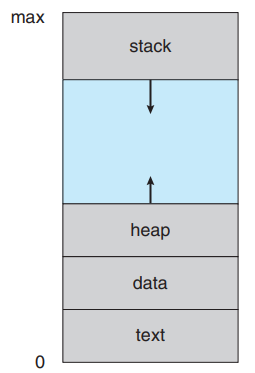
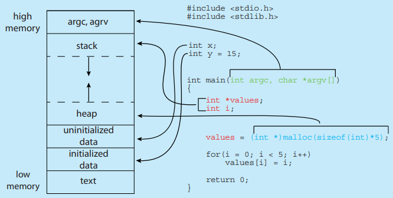
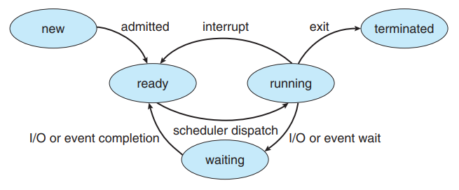
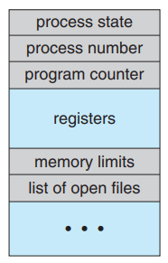

# Chapter 03 -- 行程觀念 (Processes) #

## Section Goals ##

* Identify the separate components of a process and illustrate how they are
represented and scheduled in an operating system.
  * 識別行程的各個組成部分，並說明他們如何在作業系統中表示和排班
* Describe how processes are created and terminated in an operating system, including developing programs using the appropriate system calls
that perform these operations.
  * 描述如何在作業系統中創建和終止行程，包括使用的適當系統呼叫執行這些操作來開發應用程式
* Describe and contrast interprocess communication using shared memory
and message passing.
  * 描述並對比使用共用記憶體形稱間通信和訊息傳遞
* Design programs that use pipes and POSIX shared memory to perform
interprocess communication.
  * 設計程式使用管道和 POSIX 共用記憶體以執行行程間通信
* Describe client – server communication using sockets and remote procedure calls.
  * 描述使用插座和遠程程序呼叫的客戶端 - 伺服器通信
* Design kernel modules that interact with the Linux operating system.
  * 與 Linux 作業系統交互設計的核心模組

## Section ##

* [3.1 行程的觀念 (Process Concept)](#31-行程的觀念-process-concept)
* [3.2 行程排班 (Process Scheduling)](#32-行程排班-process-scheduling)
* [3.3 行程的操作 (Operations on Processes)](#33-行程的操作-operations-on-processes)
* [3.4 行程間通信 (Interprocess Communication)](#34-行程間通信-interprocess-communication)
* [3.5 IPC 共用記憶體系統 (IPC in Shared-Memory Systems)](#35-ipc-共用記憶體系統-ipc-in-shared-memory-systems)
* [3.6 訊息傳遞系統中的 IPC (IPC in Message-Passing Systems)](#36-訊息傳遞系統中的-ipc-ipc-in-message-passing-systems)
* [3.7 IPC 系統的範例 (Examples of IPC Systems)](#37-ipc-系統的範例-examples-of-ipc-systems)
* [3.8 客戶端 - 伺服器的通信 (Communication in Client – Server Systems)](#38-客戶端---伺服器的通信-communication-in-client---server-systems)
* [3.9 摘要 (Summary)](#39-摘要-summary)

## 3.1 行程的觀念 (Process Concept) ##

* OS 是一組行程所組成，為執行系統程式碼的"作業系統行程"和執行使用者程式碼的"使用者行程"。

* CPU 運行項目的稱呼
  * 工作 (job):早期的電腦是整批式系統執行 job 。工作一詞具歷史重要性。
  * 使用者程式 (user program)、任務 (task):分時系統執行 user program 或 task 。
  * 行程 (process)

* 行程 (process)
  * 指執行中的程式。
  * 一個 process 當前活動狀態，代表目前運作的程式計數器 (program counter) 數值和處理器的站存內容。
  * 行程的記憶體配置
    * 文本區 (text section):可執行的程式碼
    * 資料區 (data section):全域變數
    * 堆積區 (heap section):隨著動態記憶體配置而增加，並在記憶體返回道系統時縮減。
    * 堆疊區 (stack section):每次呼叫函數時，包含函數參數、區域變數和返回為指的啟動記錄 (activation record) 將被壓入堆疊；當從函數返還控制權時，將從堆疊中彈出啟動記錄。
  * Process 本身可能是其他程式碼的執行環境。
    * 在大部分情況下，執行的 Java 程式是在 Java 虛擬機 (Java Virtual Machine, JVM) 內執行。JVM 是以 process 的方式執行，它會解譯載入的程式碼，然後根據程式碼採取行動 (使用原始的機器指令)。
  * Process 狀態
    * 新產生 (new):該 process 正在產生中。
    * 執行 (running):指令正在執行。
    * 等待 (waiting):等待某見事件的發生。
    * 就緒 (ready):該行程正等待指定一個處理器。
    * 結束 (terminated):該行程完成執行。
  * 任何時候只有一項 process 可以在一個處理器上執行，但卻可以有很多 process 在等待和就緒狀態。
  * Process 控制表 (Process control block, PCB)
    * process 狀態
    * 程式計數器
    * CPU 暫存器
    * CPU 排班法則想關資訊
    * 記憶體管理資訊
    * 會計資訊
    * I/O 狀態資訊
  * 執行緒 (Thread)
    * 單執行緒:只允許 process 一次執行一個任務。ex. 使用者將無法在相同的行程同時打字及進行拼字檢查。
    * 多執行緒:可以並行地執行。

    
    
行程在記憶體中的配置

    
    
記憶體的配置

    
    
行程狀態圖

    
    
行程控制表

## 3.2 行程排班 (Process Scheduling) ##

## 3.3 行程的操作 (Operations on Processes) ##

## 3.4 行程間通信 (Interprocess Communication) ##

## 3.5 IPC 共用記憶體系統 (IPC in Shared-Memory Systems) ##

## 3.6 訊息傳遞系統中的 IPC (IPC in Message-Passing Systems) ##

## 3.7 IPC 系統的範例 (Examples of IPC Systems) ##

## 3.8 客戶端 \- 伺服器的通信 (Communication in Client \- Server Systems) ##

## 3.9 摘要 (Summary) ##
