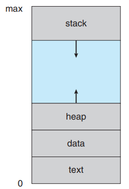
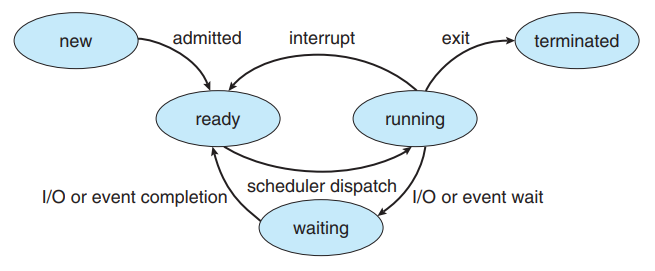
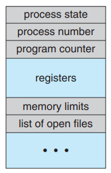
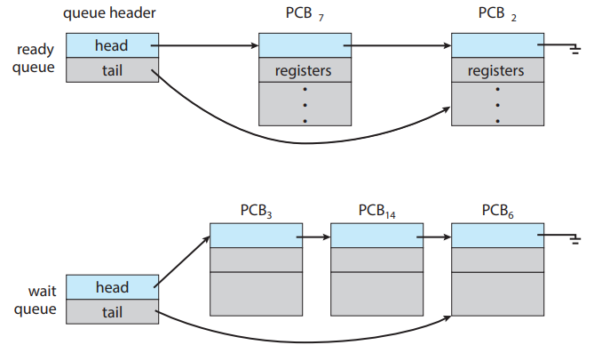
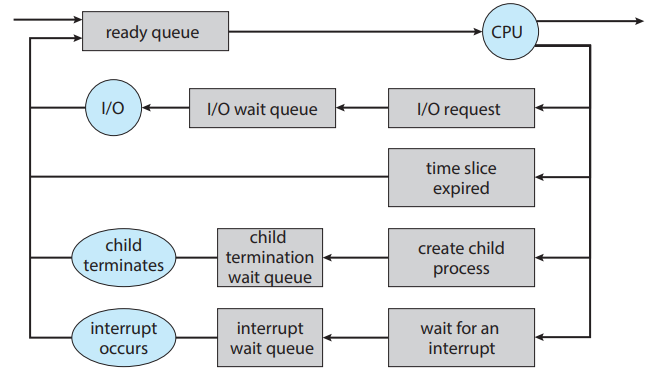
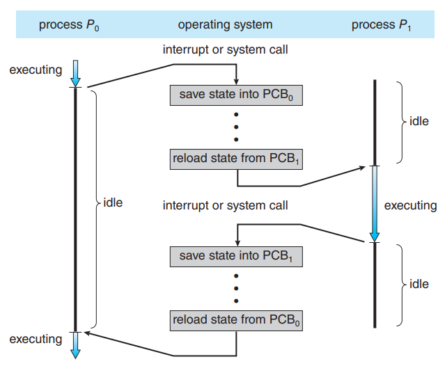
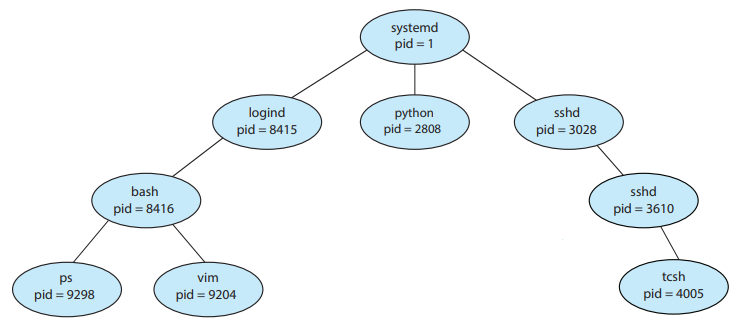
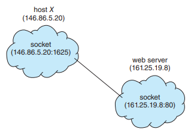

# Chapter 03 -- 行程觀念 (Processes) #

## Section Goals ##

* Identify the separate components of a process and illustrate how they are
represented and scheduled in an operating system.
  * 識別行程的各個組成部分，並說明他們如何在作業系統中表示和排班
* Describe how processes are created and terminated in an operating system, including developing programs using the appropriate system calls
that perform these operations.
  * 描述如何在作業系統中創建和終止行程，包括使用的適當系統呼叫執行這些操作來開發應用程式
* Describe and contrast interprocess communication using shared memory
and message passing.
  * 描述並對比使用共用記憶體形稱間通信和訊息傳遞
* Design programs that use pipes and POSIX shared memory to perform
interprocess communication.
  * 設計程式使用管道和 POSIX 共用記憶體以執行行程間通信
* Describe client – server communication using sockets and remote procedure calls.
  * 描述使用插座和遠程程序呼叫的客戶端 - 伺服器通信
* Design kernel modules that interact with the Linux operating system.
  * 與 Linux 作業系統交互設計的核心模組

## Section ##

* [3.1 行程的觀念 (Process Concept)](#31-行程的觀念-process-concept)
* [3.2 行程排班 (Process Scheduling)](#32-行程排班-process-scheduling)
* [3.3 行程的操作 (Operations on Processes)](#33-行程的操作-operations-on-processes)
* [3.4 行程間通信 (Interprocess Communication, IPC)](#34-行程間通信-interprocess-communication-ipc)
* [3.5 IPC 共用記憶體系統 (IPC in Shared-Memory Systems)](#35-ipc-共用記憶體系統-ipc-in-shared-memory-systems)
* [3.6 訊息傳遞系統中的 IPC (IPC in Message-Passing Systems)](#36-訊息傳遞系統中的-ipc-ipc-in-message-passing-systems)
* [3.7 IPC 系統的範例 (Examples of IPC Systems)](#37-ipc-系統的範例-examples-of-ipc-systems)
* [3.8 客戶端 - 伺服器的通信 (Communication in Client – Server Systems)](#38-客戶端---伺服器的通信-communication-in-client---server-systems)
* [3.9 摘要 (Summary)](#39-摘要-summary)

## 3.1 行程的觀念 (Process Concept) ##

* OS 是一組行程所組成，為執行系統程式碼的"作業系統行程"和執行使用者程式碼的"使用者行程"。

* CPU 運行項目的稱呼
  * 工作 (job):早期的電腦是整批式系統執行 job 。工作一詞具歷史重要性。
  * 使用者程式 (user program)、任務 (task):分時系統執行 user program 或 task 。
  * 行程 (process)

* 行程 (process)
  * 指執行中的程式。
  * 一個 process 當前活動狀態，代表目前運作的程式計數器 (program counter) 數值和處理器的站存內容。
  * 行程的記憶體配置
    * 文本區 (text section):可執行的程式碼
    * 資料區 (data section):全域變數
    * 堆積區 (heap section):隨著動態記憶體配置而增加，並在記憶體返回道系統時縮減。
    * 堆疊區 (stack section):每次呼叫函數時，包含函數參數、區域變數和返回為指的啟動記錄 (activation record) 將被壓入堆疊；當從函數返還控制權時，將從堆疊中彈出啟動記錄。
  * Process 本身可能是其他程式碼的執行環境。
    * 在大部分情況下，執行的 Java 程式是在 Java 虛擬機 (Java Virtual Machine, JVM) 內執行。JVM 是以 process 的方式執行，它會解譯載入的程式碼，然後根據程式碼採取行動 (使用原始的機器指令)。
  * Process 狀態
    * 新產生 (new):該 process 正在產生中。
    * 執行 (running):指令正在執行。
    * 等待 (waiting):等待某見事件的發生。
    * 就緒 (ready):該行程正等待指定一個處理器。
    * 結束 (terminated):該行程完成執行。
  * 任何時候只有一項 process 可以在一個處理器上執行，但卻可以有很多 process 在等待和就緒狀態。
  * Process 控制表 (Process control block, PCB)
    * process 狀態
    * 程式計數器
    * CPU 暫存器
    * CPU 排班法則想關資訊
    * 記憶體管理資訊
    * 會計資訊
    * I/O 狀態資訊
  * 執行緒 (Thread)
    * 單執行緒:只允許 process 一次執行一個任務。ex. 使用者將無法在相同的行程同時打字及進行拼字檢查。
    * 多執行緒:可以並行地執行。

    
    
行程在記憶體中的配置

    
    
記憶體的配置

    
    
行程狀態圖

    
    
行程控制表

## 3.2 行程排班 (Process Scheduling) ##

* 多元程式規劃的目的，是隨時保有一些 process 在執行，藉以最大化 CPU 的使用率。
* 分時系統的目的是將 CPU 核心在不同 process 之間不斷地轉換，以便讓使用者可以在 process 執行時和每個程式交談。
* 為了達到上述目的，行程排班程式 (process scheduler) 為 CPU 核心上執行程式選擇一個可用 process。
* 多元程式規劃的程度 (degree of multiprogramming)。
* 一般行程
  * I/O 傾向的行程 (I/O-bound process)
  * CPU 傾向的行程 (CPU-bound process)

* 排班佇列
  * 當 process 進入系統後，它們是放在就緒主列 (ready queue) 之中，且在 CPU 的核心上就緒等待執行。
  * 這個佇列一般都是用鏈結串列的方式儲存；在就緒主列前端保存著指向這個串列的第一個 PCB 的指標，而每個 PCB 中都有一個指向就緒主列中下一個 process 的指標。

* CPU 排班 (CPU Scheduler)
  * 作用:從就緒主佇列中的行程中進行選擇，並將 CPU 核心分配給它們的其中一個。
  * 置換 (swapping)
    * 將行程從記憶體中有效地移開，藉此降低多元程式規劃的程度。
    * 行程可以從記憶體到磁碟被置換出去，並且稍後從磁碟到記憶體在置換進來。

* 內容轉換 (content switch)
  * 一般而言，無論在核心模式或使用者模式，我們執行目前 CPU 狀態的狀態儲存 (state save)，然後還原狀態 (state restore)來恢復作業。

    
    
就緒佇列和等待佇列

    
    
行程排班的佇列圖表示

    
    
CPU 在行程之間內容轉換

## 3.3 行程的操作 (Operations on Processes) ##

* 系統中的各個 process 可以並行 (concurrently) 地執行，而且也要動態地產生或刪除。
* 行程的產生
  * 在一個 process 的執行期間，他可以利用產生行程的系統呼叫產生數個新的行程。
  * 每一個新產生的行程可以再產生其他的行程，形成一個行程樹 (tree)。
  * 大部分的 OS 依據唯一的行程識別碼 (process identifier, PID) 來是別 process。
  * System 行程的 PID 永遠是 1，是系統啟動時創建的第一個使用者行程。
* 行程的結束
  *

    
    
典型的 Linux 系統的行程樹

## 3.4 行程間通信 (Interprocess Communication, IPC) ##

* 種類
  1. 獨立行程 (independent process):一個行程無法與系統中正在執行的其他行程共用資料。
  2. 合作行程 (cooperating process):一個行程能夠影響其他行程，或受到其他行程影響。

* 使用合作行程的理由
  * 資訊共享
  * 加速運算
  * 模組化

* 合作行程需要有 IPC 的機制讓彼此間交換資料，也就是彼此間可寄出和接收資料。

* IPC 有兩個基本模式
  1. 共用記憶體 (shared memory)
  2. 訊息傳遞 (message passing)

  
  
通信模式。(a)共用記憶體 (b)訊息傳遞

## 3.5 IPC 共用記憶體系統 (IPC in Shared-Memory Systems) ##

* 速度較 msg-passing 來得快
* 使用記憶體位址來存儲 data
* 需要注意使用者同步問題
* 生產者 (producer) 和消費者 (consumer)
  * 生產者寫入 (in) 資料，消費者讀取 (out) 資料
* 緩衝區類型
  * 無限緩衝區 (unbounded buffer)
  * 有限緩衝區 (bounded buffer)
* 有限緩衝區使用行程共用記憶體
  * 共用 buffer 是一個環狀陣列並用兩個指標 in 和 out
    1. in 指向 buffer 中的下一個空位
    2. out 指向 buffer 中第一個填滿的位址
    3. in == out 時，buffer 就是空的
    4. ((in+1) % BUFFER_SIZE) == out 時，buffer 就是滿的
  * 因為使用環形柱列，所以會損失一個位址空間，可使用 locking 機制解決此問題
* 舉例
  * multi thread programming

## 3.6 訊息傳遞系統中的 IPC (IPC in Message-Passing Systems) ##

* 速度較 shared-memory 的方式來得慢，但是在資料較小的情況下，使很有效的
* 舉例
  * 跨電腦傳輸資料，像是 email 等等
* 邏輯上製作一個鏈與 send()/receive() 操作的方法
  1. 直接或間接聯繫
  2. 同步或非同步聯繫
  3. 自動或外在緩衝作用
* 命名
  * 直接聯繫 (direct communication)
    1. 每一個要傳送或接收訊息的行程必須先確定聯繫接收者或傳送者的名稱。
  * 間接式聯繫 (indirect communication)
    1. 需藉著信箱 (mailbox)，也叫作埠 (port)，來傳送和接收訊息。
    2. 每個信箱都有一個識別字，以便區分它們的身分。當兩個行程有共用的信箱時，它們才可以互相聯繫。
* 同步化
  * 行程間通信藉由呼叫 send() 和 receive() 基本操作完成。
  * 訊息傳遞可以是等待 (blocking) 或非等待 (nonblocking)，也稱為同步 (synchronous) 和非同步 (asynchronous)。
    1. 等待傳送 (blocking send)
    2. 非等待傳送 (nonblocking send)
    3. 等待接收 (blocking receive)
    4. 非等待接收 (nonblocking receive)
* 緩衝器
  * 經由通信行程交換的訊息是放在一個暫時的佇列。
  * 有 3 種製作這種佇列的方式
    1. 零容量 (zero capacity):可稱為一種無緩衝區的訊息系統。
    2. 有限的容量 (bounded capacity)
    3. 無限制的容量 (unbounded capacity)

## 3.7 IPC 系統的範例 (Examples of IPC Systems) ##

* 4 個不同的 IPC 系統
  1. 共用記憶體的 POSIX API
  2. Mach 作業系統的訊息傳遞
  3. Windows IPC
  4. UNIX 系統上最早的 IPC 機制之一 - 管道

## 3.8 客戶端 \- 伺服器的通信 (Communication in Client \- Server Systems) ##

* 插座 (Sockets)
  * Sockets = IP 位址 + 埠號碼 (port number)
    * 埠號碼 (port number)
      1. 1024 以下的埠是用來製作標準服務的，例如：SSH 伺服器傾聽埠 22 、FTP 伺服器傾聽埠 21 、 網頁伺服器 (http) 傾聽埠 80。1024 以上的埠，可以用來自訂。
      2. 軟體的 port 代表的就是一個 process。
  * 低層次通信式 : 一連串沒有結構的位元組。為資料加上結構是客戶端和伺服器應用程式的責任。

  
  
使用插座的通信

* 遠程程序呼叫 (Remote Procedure Calls, RPCs)
  * 高層次通信式 : 具有良好的結構，為系統上層的 API。

## 3.9 摘要 (Summary) ##
