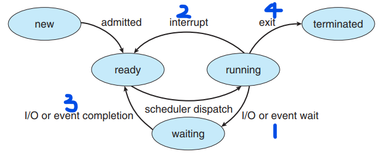

# Chapter 05 -- CPU 排班 (CPU Scheduling) #

* 藉由 CPU 在不同 process 之間的轉換，OS 可以讓電腦的產量提高。
* 當討論一般的排班概念時，使用的是行程排班 (process scheduling) ；而提到特定執行緒觀念時，使用的是執行緒排班 (thread scheduling) 。
* 核心 (core) 是 CPU 的基本單位。行程是在 CPU 的核心上執行的。
* 使用將行程排程為 "在 CPU 上執行" 的通用術語，就意味著該行程在 CPU 的核心上執行。

## Section Goals ##

* 描述各種 CPU 排班演算法
* 根據排班標準評估 CPU 排班演算法
* 解釋多處理器和多核心排班相關的問題
* 描述各種即時排班演算法
* 描述 Windows、Linux 和 Solaris 作業系統中使用的排班演算法
* 應用模型和模擬來評估 CPU 排班演算法
* 設計一個流程實現幾種不同的 CPU 排班演算法

## Section ##

* [5.1 基本觀念 (Basic Concepts)](#51-基本觀念-basic-concepts)
* [5.2 排班原則 (Scheduling Criteria)](#52-排班原則-scheduling-criteria)
* [5.3 排班演算法 (Scheduling Algorithms)](#53-排班演算法-scheduling-algorithms)
* [5.4 執行緒排班 (Thread Scheduling)](#54-執行緒排班-thread-scheduling)
* [5.5 多處理器的排班問題 (Multi-Processor Scheduling)](#55-多處理器的排班問題-multi-processor-scheduling)
* [5.6 即時 CPU 排班 (Real-Time CPU Scheduling)](#56-即時-cpu-排班-real-time-cpu-scheduling)
* [5.7 作業系統範例 (Operating-System Examples)](#57-作業系統範例-operating-system-examples)
* [5.8 演算法的評估 (Algorithm Evaluation)](#58-演算法的評估-algorithm-evaluation)
* [5.9 摘要 (Summary)](#59-摘要-summary)

## 5.1 基本觀念 (Basic Concepts) ##

* 在單一 CPU 核心系統裡，同一時間只能有一個行程在執行，等 CPU 的核心有空時，才能接著重新排班。
* 多元程式規劃系統的主要目的，就是要隨時保有一個行程在執行，藉以提高 CPU 使用率。

### 5.1.1 CPU-I/O 分割週期 ###

* Process 的執行是由 CPU 執行時間及 I/O 等待時間所組成的週期 (cycle) ，process 在這兩個狀態之間交替往返。
* Process 執行由一個 CPU 分割 (CPU burst) 開始，接著是一個 I/O 分割 (I/O burst) ，然後又是一個 CPU 分割，再接著一個 I/O 分割，依此方式繼續。
* 最後一個  CPU 分割結束的時候，同時會有一個系統要求中止執行這個工作。

    
    
CPU 分割和 I/O 分割交替排列的順序

### 5.1.2 CPU 排班器 ###

* 當 CPU 閒置時，OS 必須從就緒佇列之中選出一個 process 來執行。
* 選取 process 是由 CPU 排班器 (CPU schedular) 來執行，排班器自記憶體之中準備要執行的數個 process 中選出一個，並將 CPU 配置給它。
* 就緒佇列可製作成 FIFO 佇列、優先次序佇列、樹狀佇列或僅為毫無順序的鏈結串列。
* 佇列中的紀錄通常是 process 的 行程控制表 (process control block, PCBs) 。

### 5.1.3 可搶先與不可搶先排班 ###

* CPU 排班的決策發生在下面的 4 種狀況
  1. Process 從 running 轉變成 waiting (ex. I/O 要求、呼叫 wait() 等待子行程的結束)
  2. Process 從 running 轉變成 ready (ex. 當有中斷發生時)
  3. Process 從 waiting 轉變成 ready (ex. I/O 的結束)
  4. Process terminated

    
    
行程狀態圖

* 對狀況 1 和 4 而言，CPU 只能在就緒佇列中選擇一個新的 process 來執行。
* 如果排班只發生在 1 和 4 時，我們稱這種排班方法為不可搶先 (nonpreemptive) 或合作 (cooperative) ；否則就稱為可搶先 (preemptive) 。
* 在不可搶先排班方法下，一旦 CPU 配置給一個行程時，此行程將一直保有 CPU ，直到它 terminated 或轉換到 waiting 狀態，釋放出 CPU 為止。
* 幾乎所有現在 OS 都使用可搶先排班法。 (ex. Windows, macOS, Linux, UNIX)
* 可搶先排班法在存取共用資料時，可能造成競爭關係 (race condition) 。
* OS kernal 可以設計為不可搶先或可搶先。不可搶先 kernal 將在系統呼叫完成或等待行程阻塞發生時 I/O 完成，才作內容轉換，以便解決競爭關係。可搶先 kernal 需要諸如 mutex 之類的機制，防止在存取共享核心資料結構時出現競爭情況。
* 大多數現代 OS 在以核心模式 (kernal mode) 運行時，都完全可搶先。

### 5.1.4 分派器 ###

* 在 CPU 排班功能包含的另外一個元件就是分派器 (dispatcher)，分派器就是將 CPU 控制權交給短程排班器選出行程時所採用的模組。
* 分派器的功能包括
  1. 內容轉換 (content switch)
  2. 轉換成使用者模式 (user mode)
  3. 跳躍到使用者程式的適當位置，以便重新開啟程式
* 分派器用來停止一個行程，並啟動另一個行程所用的時間，就是所謂的分派延遲 (dispatch latency) 。

    
    
分派器的腳色

  
## 5.2 排班原則 (Scheduling Criteria) ##

## 5.3 排班演算法 (Scheduling Algorithms) ##

## 5.4 執行緒排班 (Thread Scheduling) ##

## 5.5 多處理器的排班問題 (Multi-Processor Scheduling) ##

## 5.6 即時 CPU 排班 (Real-Time CPU Scheduling) ##

## 5.7 作業系統範例 (Operating-System Examples) ##

## 5.8 演算法的評估 (Algorithm Evaluation) ##

## 5.9 摘要 (Summary) ##
